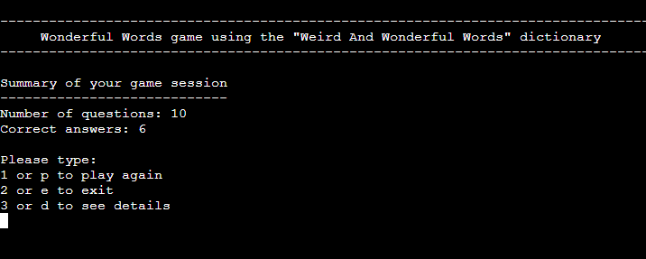

# Wonderful Words Game

## User's Goal

The users of the <em>Wonderful Words Game</em> want to play an online multiple-choice quiz game that will enrich their vocabulary with unusual words.

## Target Audience

The <em>Wonderful Words Game</em> is targeted to adults who are word lovers and have fun with learning new words.

## Owner's Goal

The goal of the <em>Wonderful Words Game</em> is to entertain people and foster the learning of new words. 

## Description of the Game

In each game session, the user will be asked a series of questions. Each question will have a number of options to choose from. 

The number of questions and number of options are defined by the user before the session starts. 

For each question, only one option is correct.

Below is a screenshot where a question number 7 is presented to the user along with the options the user can choose. This screenshot was taken from a game session with 10 questions and 6 options per question.

After the last question, a summary of the game session is presented. At this point, the user can choose to play again, exit or see the details.

The details consist in presenting each question again, along with the correct answer and the user's answer.

## Features 

### Existing Features

- The starting screen

A welcome message and an introductory explanation is presented to the user.

- Ability to choose the number of questions

The user can choose the number of questions in a game session. 

The possible values are in the `[min_n_questions, max_n_questions]` integer interval that is defined in the object pointed by the game_settings variable in the game_settings.py file.

    game_settings = {
        ...
        "min_n_questions": 1,
        "max_n_questions": 10,
        ...
    }

- Ability to choose the number of options

The user can choose the number of options that will be made available per question in a game session.

The possible values are in the `[min_n_options, max_n_options]` integer interval that is defined in the object pointed by the game_settings variable in the game_settings.py file.

    game_settings = {
        ...
        "min_n_options": 2,
        "max_n_options": 6,
        ...
    }

- Preparation of questions and corresponding options to answer

For each game session, the program randomically picks up the set of questions and options to answer those questions.

The questions and options to answer are picked up from the dictionary that is defined in the object pointed by the game_settings variable in the game_settings.py file.

    game_settings = {
        ...
        "game_dictionary": {
            ....
        }
    }

- Present a question and collect the answer

Along the game session, each questions is presented with the corresponding options to answer and then the answer is collected.

The answer is kept in memory in the object pointed by the user experience list (`__ux_list`) instance variable of the GameSession class.

Below is an example of possible contents of `__ux_list` at the end of a game session with 2 questions and 2 options per question. In this example, the user got the first question wrong and the second question right.

    [
        {
            'question_number': 1,
            'question': 'the hybrid off spring of a male tiger and a lioness (the offspring of a male lion and a tigress being a liger)',
            'correct_answer': 'tigon',
            'options': ['struthious', 'tigon'],
            'user_answer': 'struthious'
        }, 
        {
            'question_number': 2,
            'question': 'the practice of registering well-known names as Internet domain names, in the hope of reselling them at a profit',
            'correct_answer': 'cybersquatting',
            'options': ['cupreous', 'cybersquatting'],
            'user_answer': 'cybersquatting'
        }
    ]
