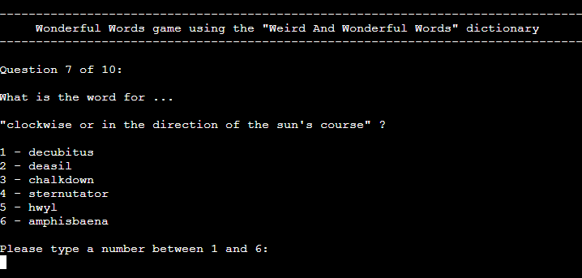
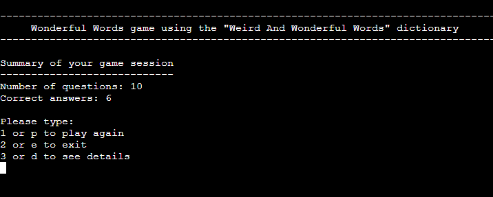
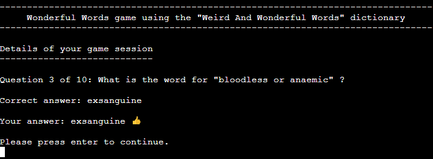
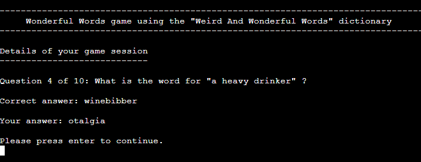

# Wonderful Words Game

## User's Goal

The users of the <em>Wonderful Words Game</em> want to play an online multiple-choice quiz game that will enrich their vocabulary with unusual words.

## Target Audience

The <em>Wonderful Words Game</em> is targeted to adults who are words lovers and have fun with learning new words.

## Owner's Goal

The goal of the <em>Wonderful Words Game</em> is to entertain people and foster the learning of new words. 

## Description of the Game

In each game session, the user will be asked a series of questions. Each question will have a number of options to choose from. This number of options is fixed per session, defined by the user before the session starts, as is the number of questions. For each question, only one option is correct.

Below is a screenshot with the 7th question of a game session with 10 questions and 6 options per question.

After the last question, a summary of the game session is presented.

Then, the user can choose to see the details. The details consist in presenting each question again, along with the correct answer and the user's answer.

