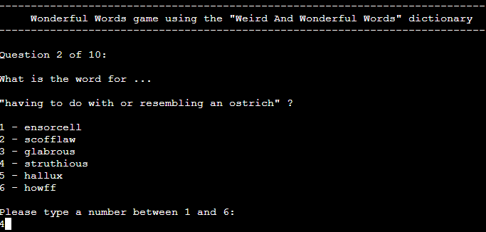

# Wonderful Words Game

This project is about developing a multiple-choice quiz game. The users choose the number of questions and how many options per question they would like to see. During each game session, the game questions are randomically selected from an English dictionary.

<a href="https://wonderful-words.herokuapp.com/" target="_blank">Here</a> is the link to the live website.

## Table of Contents

1. [User's Goal](#users-goal)
2. [Target Audience](#target-audience)
3. [Owner's Goal](#owners-goal)
4. [Description of the Game](#description-of-the-game)
5. [Project Objectives](#project-objectives)
6. [Features](#features)
    1. [Existing Features](#existing-features)
    2. [Future Features](#future-features)
7. [Technologies](#technologies)
8. [Testing](#testing)
   1. [T1 Validate Questions, Answers and Evaluation](#t1-validate-questions-answers-and-evaluation)
   2. [T2 Validate Summary of the Game](#t2-validate-summary-of-the-game)
   3. [T3 Validate User Input](#t3-validate-user-input)
   4. [T4 Validator Testing](#t4-validator-testing)
   5. [T5 Unfixed bugs](#t5-unfixed-bugs)
9. [Deployment](#deployment)
10. [Credits](#credits)

## User's Goal

The users of the <em>Wonderful Words Game</em> want to play an online multiple-choice quiz game that will enrich their vocabulary with unusual words. They like to be engaged with this kind of games so being engaged is also a user's goal.

[Back to TOC](#table-of-contents)

## Target Audience

The <em>Wonderful Words Game</em> is targeted to adults who are word lovers and have fun with learning new words.

[Back to TOC](#table-of-contents)

## Owner's Goal

The goal of the <em>Wonderful Words Game</em> is to:
* Entertain people 
* Foster the learning of new words
* Engage the user
  * Get users to play repeatedly 
  * Have the users repeating visits to the website

[Back to TOC](#table-of-contents)

## Description of the Game

In each game session, the user will be asked a series of questions. Each question will have a number of options to choose from. 

The number of questions and number of options are defined by the user before the session starts. 

For each question, only one option is correct.

Below is a screenshot where a question number 7 is presented to the user along with the options the user can choose. This screenshot was taken from a game session with 10 questions and 6 options per question.

After the last question, a summary of the game session is presented. At this point, the user can choose to play again, exit or see the details.

The details consist in presenting each question again, along with the correct answer and the user's answer.

[Back to TOC](#table-of-contents)

## Project Objectives

The objectives of working on this project are:

* Write Python code that follows the PEP8 guidelines.
* Ensure all the functionalities of the <em>Wonderful Words Game</em> work.
* Write readable, indented and clear code, with consistent and meaningful naming conventions.
* Write code that handles empty or invalid input data.
* Clearly separate and identify code written for the application and code from external sources (e.g. Python random library external source).
* Write code that ensures a consistent flow of logic and data with well defined granular functions.
* Implement standard programming constructs such as flow control, iteration, selection, functions, object-oriented programming and data structures - as appropriate - to achieve the <em>Wonderful Words Game</em> project goals.
* Implement exception/error handling to optimize the user experience. If the user accidently answers with something invalid, the program will not stop. The program will ask again so that the user can continue.
* Document the project by using consistent and effective markdown formatting, well-structured and easy to follow.
* Explains the project purpose and the value that it provides to its users.
* Identify and repair coding errors during the development and testing work.
* Implement manual testing procedures for code validation.
* Use library software for building the program. Implement the use of external Python libraries where appropriate to provide the functionality that the project requires (Python random library).
* Implement a data model, application features and business logic to manage, query and manipulate data to meet given needs in a particular real-world domain. Implement a working data model that supports the intended project functionality. Write code that queries and manipulates data to meet the identified vital project needs.
  * In the <em>Wonderful Words Game</em> program, the information about the game session is kept in memory, updated each time the user responds to a game question and accessed at the end of the game session, to present the summary and the details of the game session to the user.
* Demonstrate and document the development process through a version control system such as GitHub. Use Git & GitHub for version control of the web application up to deployment.
* Deploy a final version of the application code to a cloud-based platform (Heroku). Ensure that the deployed application is free of commented out code.

[Back to TOC](#table-of-contents)

## Features 

### Existing Features

#### The starting screen

A welcome message and an introductory explanation is presented to the user.

#### Ability to choose the number of questions

The user can choose the number of questions in a game session. 

The possible values are in the `[min_n_questions, max_n_questions]` integer interval that is defined in the object pointed by the game_settings variable in the game_settings.py file.

    game_settings = {
        ...
        "min_n_questions": 1,
        "max_n_questions": 10,
        ...
    }

#### Ability to choose the number of options

The user can choose the number of options that will be made available per question in a game session.

The possible values are in the `[min_n_options, max_n_options]` integer interval that is defined in the object pointed by the game_settings variable in the game_settings.py file.

    game_settings = {
        ...
        "min_n_options": 2,
        "max_n_options": 6,
        ...
    }

#### Preparation of questions and corresponding options to answer

For each game session, the program randomically picks up the set of questions and the options for answering those questions.

The questions and options to answer are picked up from the dictionary that is defined in the object pointed by the game_settings variable in the game_settings.py file.

    game_settings = {
        ...
        "game_dictionary": {
            ....
        }
    }

#### Present a question and collect the answer

Along the game session, each question is presented with the corresponding options to answer and then the answer is collected.

The collected user answer is kept in memory in the object pointed by the user experience list (`__ux_list`) instance variable of the GameSession class.

Below is an example of possible contents for the `__ux_list` instance variable at the end of a game session with 2 questions and 2 options per question. In this example, the user got the first question wrong and the second question right.

    [
        {
            'question_number': 1,
            'question': 'the hybrid off spring of a male tiger and a lioness (the offspring of a male lion and a tigress being a liger)',
            'correct_answer': 'tigon',
            'options': ['struthious', 'tigon'],
            'user_answer': 'struthious'
        }, 
        {
            'question_number': 2,
            'question': 'the practice of registering well-known names as Internet domain names, in the hope of reselling them at a profit',
            'correct_answer': 'cybersquatting',
            'options': ['cupreous', 'cybersquatting'],
            'user_answer': 'cybersquatting'
        }
    ]

Regarding tha above list, we can say:
* The first element represents question number 1.
* The second element represents question number 2.
* In the first element we can see that the value of `correct_answer` is different from the value of `user_answer`. That means the user did not get it right.
* In the second element we can see that the value of `correct_answer` is equals to the value of `user_answer`. That means the user got it right.

#### Summary of the game session

The summary is presented after the last question.

#### Details of the game session

If the user selects the details option, after the summary, the details are presented. 

The details consist in presenting all the questions again, one at a time, with the correct answer and the user answer.

After the last question presented in the details, the user can choose to play again or exit.

### Future Features

In a future release, the following feature is planned to be implemented.

#### Ability to choose the dictionary

Currently, only one dictionary is used in this game. The user has no option to choose the dictionary.

In the current version, there is only the "Weird And Wonderful Words" dictionary, which is great, but is not good for all purposes. For example this dictionary is not good for beginners or for children.

The current structure of the game settings is as follows.

    game_settings = {
        "game_dictionary_name": "Weird And Wonderful Words",
        "min_n_questions":1,
        "max_n_questions":10,
        "min_n_options":2,
        "max_n_options":6,
        "game_dictionary": {
            "word-1": "description-1",
            "word-2": "description-2",
            ...
            "word-n": "description-n"
        }
    }

A future version of this game is planned to accommodate different dictionaries.

In this future version, the structure of the game settings will be as shown below.

    game_settings = {
       "min_n_questions":1,
       "max_n_questions":10,
       "min_n_options":2,
       "max_n_options":6,
       "dictionaries":[
          {
             "dictionary_name":"Weird And Wonderful Words",
             "game_dictionary":{
                "word-1":"description-1",
                "word-2":"description-2",
                "word-n":"description-n"
             }
          },
          {
             "dictionary_name":"Basic English Dictionary",
             "game_dictionary":{
                "word-1":"description-1",
                "word-2":"description-2",
                "word-n":"description-n"
             }
          },
          {
             "dictionary_name":"Children English Dictionary",
             "game_dictionary":{
                "word-1":"description-1",
                "word-2":"description-2",
                "word-n":"description-n"
             }
          }
       ]
    }

By using the above structure, it will be possible to adapt the Python code for this game so that the user will be able to choose the dictionary at runtime.

Note, this new feature will broaden the <em>Wonderful Words Game</em> target audience.

[Back to TOC](#table-of-contents)

## Technologies

* [Python 3.8.11](https://www.python.org/downloads/release/python-3811/)

Used as the programming language. Python 3.8.11 (default, Jan  8 2022, 13:13:11).

* <a href="https://docs.python.org/3.8/library/random.html" target="_blank">Python random.py library</a>

Used to generate pseudo-random numbers.

* <a href="https://gitpod.io/" target="_blank">GitPod</a>

Used for coding, testing, documenting, committing and pushing to GitHub.

* <a href="https://github.com/" target="_blank">GitHub</a>

Used for version control of code and version control of the documentation. Here is where the source code and documentation of the project resides.

* <a href="https://id.heroku.com/" target="_blank">Heroku</a>

Used to deploy the application.

* <a href="http://pep8online.com/" target="_blank">PEP8 online check</a>

Used to validate the Python code.

[Back to TOC](#table-of-contents)

## Testing

In this section, a game with X questions and Y options per question is referred to as an X/Y game.

### T1 Validate Questions, Answers and Evaluation
The tests in this section are to validate the correctness of questions and possible answers presented to the user and the correctness of the evaluation of the answers.

Test Conditions:
1. All questions and options must be taken from the game dictionary. 
1. There must be only one correct answer. 
1. When the user selects the correct answer, the game must consider this answer correct.
1. When the user selects an incorrect answer, the game must not consider this answer correct. 

Based on the https://www.lexico.com/explore/weird-and-wonderful-words dictionary, a series of game sessions was played and all the answers were validated against the dictionary. No errors were found.

Below are some examples of the tests that were conducted, with different numbers of questions and different numbers of options.

#### T1.1 Question in a 10/3 game

User selects the correct answer. Conditions 1, 2 and 3 must be satisfied.

Correct answer is 'decubitus'.

Result: Success.

Details: User selected correct answer. Conditions 1, 2 and 3 were verified.

#### T1.2 Question in a 10/6 game

User selects an incorrect answer. Conditions 1, 2 and 4 must be satisfied.

Correct answer is 'afreet'.

Result: Success.

Details: User selected incorrect answer. Conditions 1, 2 and 4 were verified.

#### T1.3 Question in a 1/1 game

User selects an incorrect answer. Conditions 1, 2 and 4 must be satisfied.

Correct answer is 'higgler'.

Result: Success.

Details: User selected incorrect answer. Conditions 1, 2 and 4 were verified.

### T2 Validate Summary of the Game

#### T2.1 Testing a 10/6 game 

First 3 questions with correct answer. Remaining questions with wrong answer and choosing different numbers along the session.
Expected result: 3 correct questions.

Result: Success.
Details: the summary of the game presents 3 as the number of correct answers.

### T3 Validate User Input

These tests are to ensure that a distracted or misbehaving user will not break the game.

Here are some examples of what has been validated to ensure the program is correct in terms of input validation. For all the test cases below, several tests were conducted. The screenshots are only examples of the results.

#### T3.1 User Input How Many Questions

Answering to the "How Many Questions" question with the following values:
* space
* 0
* 11
* g
* %

Expected Result: program must not accept those values.

Acceptable values in this case would be: 1, 2, 3, 4, 5, 6, 7, 8, 9 or 10.

Result: Success.

#### T3.2 User Input How Many Options

Answering to the "How Many Options" question with the following values:
* space
* "1"
* "7"
* "h"
* "£"

Expected Result: program must not accept those values.

Acceptable values in this case would be: 2, 3, 4, 5 or 6.

Result: Success.

#### T3.3 User Input Answer a Game Question

Answering to a game question in a X/3 game with the following values:
* "number 2"
* "Zyrian"
* "0"
* "4"
* "h"
* "?"

Expected Result: program must not accept those values.

Acceptable values in this case would be: 1, 2 or 3.

Result: Success.

#### T3.4 User Input Play, Exit or Details

Answering to a play, exit or details question with the following values:
* "4"
* "0"
* "details"

Expected Result: program must not accept those values.

Acceptable values in this case would be: 1, p, P, 2, e, E, 3, d or D.

Result: Success.

#### T3.5 User Input Play or Exit

Answering to a play or exit question with the following values:
* space
* "3"
* "0"
* "play again"

Expected Result: program must not accept those values.

Acceptable values in this case would be: 1, p, P, 2, e or E.

Result: Success.

### T4 Validator Testing

Python code for run.py and game_settings.py was submitted to http://pep8online.com with the following results.

#### T4.1 run.py

Expected Result: All right

Result: All right

#### T4.2 game_settings.py

Expected Result: All right

Result: no newline at end of file

The game_settings.py file was updated and submitted again to the pep8 validator and this time the result was 'All right'.

### T5 Unfixed bugs

There are no unfixed bugs.

[Back to TOC](#table-of-contents)

## Deployment

The steps used to deploy the <em>Wonderful Words Game</em> are explained below:

<a href="https://id.heroku.com/" target="_blank">Heroku</a> was used to deploy the application.

1. Make sure the requirements.txt file is correct. 
   * This was done by running: `pip3 freeze > requirements.txt` in the GitPod terminal. No requirements were identified, no requirements were written to the requirements.txt file.
2. Logged into the <a href="https://id.heroku.com/" target="_blank">Heroku</a> website, choose "New" > "Create new app".
3. Enter the "App name", "Choose a region" and then click "Create app".
4. Click "Settings" and then in the "Config Vars" section, click "Reveal Config Vars".
5. Type PORT in the KEY input field and type 8000 in the VALUE input field and then click "Add".
6. In the "Buildpacks" section, click "Add buildpack".
7. Select "python" and click "Save changes".
8. In the "Buildpacks" section, click "Add buildpack".
9. Select "node.js" and click "Save changes".
10. In the "Deployment method" section, click "Deploy" and then click "GitHub".
11. In the "Connect to GitHub" section, search the "wonderful" repository (jmarcosdias/wonderful).
12. Click "Connect", next to the repository name (jmarcosdias/wonderful).
13. In the "Manual deploy" section, click "Deploy Branch", to deploy from the main branch.
14. Wait for the deploy to finish. You will see the build log in the "Manual deploy" section.
15. Click the "View" button in the "Manual deploy" section or click "Open app" at the top of the page. This is for you to confirm that the app is deployed.
16. In the "Automatic deploys" section, click "Enable Automatic Deploys".

[Back to TOC](#table-of-contents)

## Credits

* Lexico.com for the <a href="https://www.lexico.com/explore/weird-and-wonderful-words" target="_blank">dictionary</a> used in this game (https://www.lexico.com/explore/weird-and-wonderful-words).
* Code Institute for the deployment terminal.

[Back to TOC](#table-of-contents)